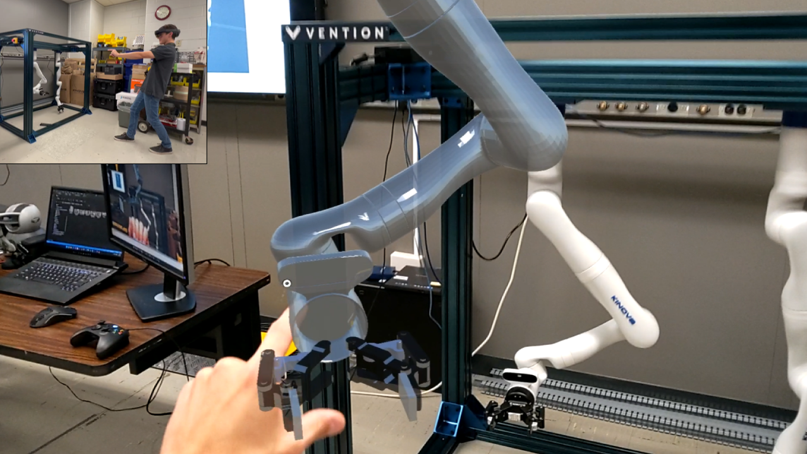
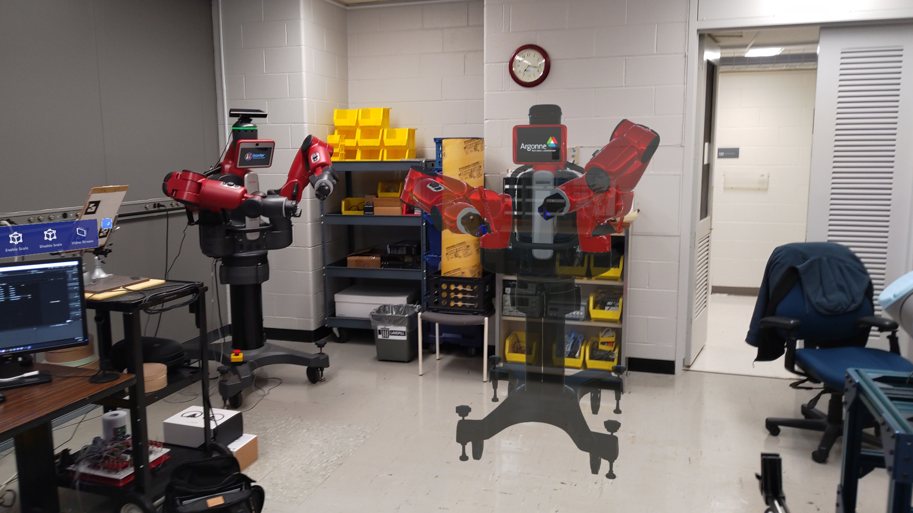
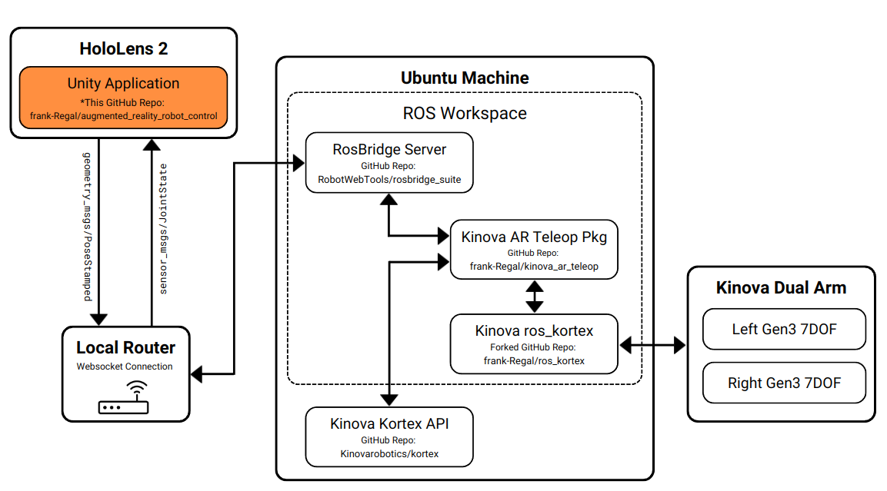

# Augmented Reality Robot Control
### About
HoloLens 2 augmented reality application used to enable users to remotely teleop robotic arms. This is a Unity Application.

Currently Supported Arms:
- ReThink Robotics Baxter Dual Arm
- Kinova Robotics Gen3 7DOF Dual Arm Setup

##### Note: This is an updated repo based on [GitHub - frank-Regal/baxter_ar_teleop](https://github.com/frank-Regal/baxter_ar_teleop.git 'https://github.com/frank-Regal/baxter_ar_teleop.git') with the intention to be a modular version that can support more robotic arms.

 


### Branch Descriptions
- ```devel``` - main branch. Create a branch off this one to contribute.

### System Overview


##### Figure 1: Showing an example of how this Unity Application fits into the overall system to control robots. This flow chart is for the Kinova robots, but a similar flow chart is used for the baxter robot. The orange highlights were this project fits in.

## Getting Started
### Tested Versions
- [Unity 2020.3.35f1](https://unity3d.com/get-unity/download 'https://unity3d.com/get-unity/download')
- [Visual Studio Community 2019 v16.8.3](https://visualstudio.microsoft.com/downloads/ 'https://visualstudio.microsoft.com/downloads/')
    - In Visual Studio Installer ensure you have installed:
        - .NET desktop development
        - Desktop development with C++
        - Universal Windows Platform development
            - USB Device Connectivity
            - Windows 10 SDK (10.0.18362.0)
        - Game development with Unity
        - Geme development with C++    
- [Windows 10 SDK v10.0.19041.0](https://developer.microsoft.com/en-us/windows/downloads/windows-sdk/ 'https://developer.microsoft.com/en-us/windows/downloads/windows-sdk/')

### Download and Open Unity App
1. Download the zip file of this repo or clone it to your computer```git clone --recursive https://github.com/frank-Regal/augmented_reality_robot_control.git```
2. Open Unity Hub and click "Add project from disk" from the drop down "Open" menu to find and select your cloned repo.
3. Select 2020.3.35f1 from the drop down menu in the editor version column.
4. Double click to open the project.
5. All third person view work is done in the main scene called ```MainScene``` which should be highlighted in the ***Hierachy panel***.
    - If not open it by navigating and selecting the ```MainScene.unity``` file from within Unity by clicking ```File -> Open Scene -> Scenes -> MainScene.unity```

### Configure Unity App
1. From the Unity ***Hierarchy panel***, select the ```RosConnector``` game object.
2. With ```RosConnector``` still selected, navigate to the ```Ros Connector (Script)``` in the ***Inspector panel*** and configure it as follows:
    - Under the *Serializer* dropdown menu ensure ```Newtonsoft_JSON``` is selected.
    - Under the *Protocol* dropdown menu ensure ```Web Socket UWP``` is selected.
    - Under *Ros Bridge Server Url* ensure that the IP address to your Ros Bridge Server is correctly written. As example you should have an IP address that looks similar to the following: ```ws://192.168.1.6:9090```

### Build and Deploy Unity App to HoloLens 2
1. Follow this tutorial to build for HoloLens 2: [Build and Deploy to the HoloLens](https://docs.microsoft.com/en-us/windows/mixed-reality/develop/unity/build-and-deploy-to-hololens 'https://docs.microsoft.com/en-us/windows/mixed-reality/develop/unity/build-and-deploy-to-hololens')
2. Follow this tutorial to deploy to HoloLens 2: [Using Visual Studio to deploy and debug](https://docs.microsoft.com/en-us/windows/mixed-reality/develop/advanced-concepts/using-visual-studio?tabs=hl2 'https://docs.microsoft.com/en-us/windows/mixed-reality/develop/advanced-concepts/using-visual-studio?tabs=hl2')

### Running Application
1. Run the robots launch files first from the setup steps you went through in the above step. This will ensure your RosBridge server Websocket connection is running.
2. Navigate to the HoloLens application and launch.
3. On start up screen, select the robot you want to control / have ready to be controlled.
    - NOTE: Nothing will happen unless you have the robotic arm software runnning. Follow the steps below to setup your robotic arms.

### Robotic Arm Setup
- #### Kinova Gen3 7DOF Dual Arm
    - Setup Instructions [GitHub - frank-Regal/kinova_ar_teleop](https://github.com/frank-Regal/kinova_ar_teleop 'https://github.com/frank-Regal/kinova_ar_teleop')
- #### Baxter Dual Arm
    - Setup Instructions [GitHub - anlyoung/kaeri_teleop](https://github.com/anlyoung/kaeri_teleop 'https://github.com/anlyoung/kaeri_teleop')

## Contributing to the Unity App
### Experienced Unity Developers 
Fork this repo. The application is fully functional in simulation. Using the "Play" button at the top of the Unity editor you can enter into the same scene you would enter if you were opening the app on the HoloLens. A few notes for getting the same functionality in the Unity Editor simulator as you would in the HoloLens.
1. Make sure you are connected to the same network as the robot and your firewalls are not restricting communication between the robot and your machine.
2. Make sure your ```Ros Connector (Script)``` settings are configured as follows control the robot from simulation
    - Under the *Serializer* dropdown menu ensure ```Newtonsoft_JSON``` is selected.
    - Under the *Protocol* dropdown menu ensure ```Web Socket Sharp``` is selected.
    - Under *Ros Bridge Server Url* ensure that the IP address to your Ros Bridge Server is correctly written. As example you should have an IP address that looks similar to the following: ```ws://192.168.1.6:9090```
3. Make sure you are famaliar with using the hand gestures in simulation. A tutorial on controlling MRTK hand gestures from within Unity can be found here: [Using Hands in Unity with MRTK](https://docs.microsoft.com/en-us/learn/modules/mixed-reality-toolkit-project-unity/7-exercise-hand-interaction-objectmanipulator 'https://docs.microsoft.com/en-us/learn/modules/mixed-reality-toolkit-project-unity/7-exercise-hand-interaction-objectmanipulator')

### Novice Unity Developers 
#### Learn How To Create This Project from Scratch
Tutorial on how to replicate this project on your own. Please request access if you are restricted access.

- [Tutorial: Building Baxter AR Teloperation Application](https://docs.google.com/document/d/1IbUh4coWxempv4kRiAWMmxlxtNeg4E3t1pIcTP4Cmf0/edit?usp=sharing 'Building Basic Baxter AR Application')

## References
- ROS Sharp plugin used to work with HoloLens 2: [GitHub - EricVoll/ros-sharp](https://github.com/EricVoll/ros-sharp 'https://github.com/EricVoll/ros-sharp')
- Microsoft Mixed Realtiy Toolkit (MRTK): [MRTK Documentation](https://docs.microsoft.com/en-us/learn/modules/learn-mrtk-tutorials/ 'Mixed Reality Toolkit')
